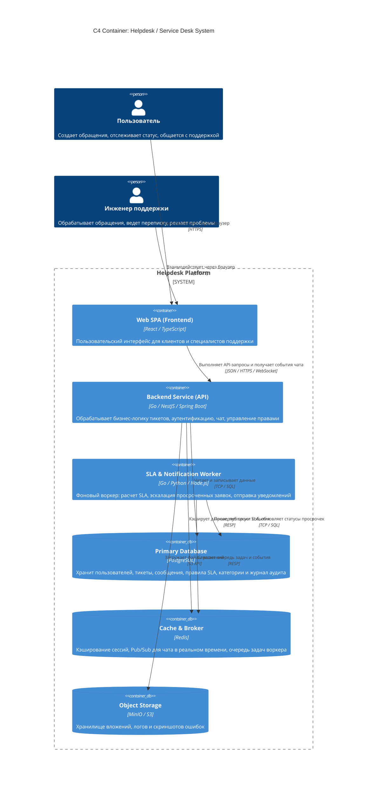
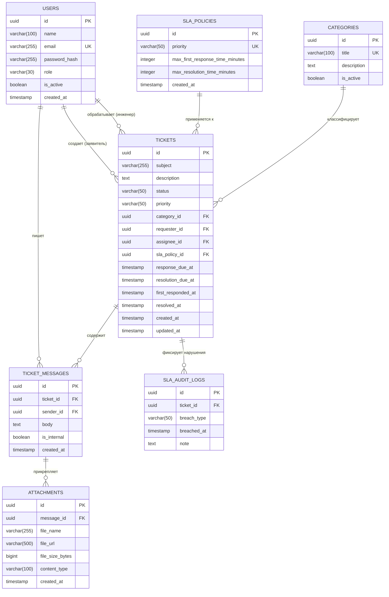

# Архитектурный отчет: Служба поддержки и тикет-система (Helpdesk / Service Desk)

## 1. Описание предметной области и ролевая модель

Система предназначена для автоматизации процессов технической поддержки, приема и обработки пользовательских запросов (инцидентов и проблем), контроля регламентных сроков реагирования (SLA) и ведения прозрачной истории коммуникации между заявителями и специалистами.

### Роли пользователей и Use Cases

#### Роль: Пользователь (Клиент / Заявитель)
* **UC-1.1: Регистрация и аутентификация** — создание учетной записи, вход в систему через логин/пароль или SSO.
* **UC-1.2: Создание обращения (тикета)** — подача заявки с указанием категории, описания проблемы, желаемой срочности и прикреплением сопутствующих файлов/скриншотов.
* **UC-1.3: Просмотр и отслеживание статуса заявок** — просмотр списка своих обращений, текущего статуса жизненного цикла (`OPEN`, `IN_PROGRESS`, `WAITING_FOR_USER`, `RESOLVED`, `CLOSED`) и оставшегося времени по SLA.
* **UC-1.4: Ведение диалога по тикету** — добавление сообщений, уточняющих файлов и ответов на запросы инженера поддержки.
* **UC-1.5: Закрытие и оценка качества** — подтверждение решения проблемы, выставление оценки удовлетворенности (CSAT) и закрытие обращения.

#### Роль: Инженер поддержки (Специалист / Support Agent)
* **UC-2.1: Просмотр очереди заявок и фильтрация** — выборка тикетов по статусам, приоритетам, категориям и близости дедлайна SLA.
* **UC-2.2: Взятие тикета в работу / переназначение** — назначение обращения на себя или передача коллеге / другой линии технической поддержки.
* **UC-2.3: Обработка тикета и коммуникация** — отправка публичных ответов пользователю, а также добавление внутренних заметок (*Internal Notes*), скрытых от заявителя.
* **UC-2.4: Управление статусом и приоритетом** — изменение статуса жизненного цикла тикета, корректировка приоритета на основе объективной критичности инцидента.
* **UC-2.5: Контроль соблюдения регламентов SLA** — фиксация времени первого ответа (*First Response Time*) и времени финального устранения проблемы (*Resolution Time*).

---

## 2. Диаграмма C4 Container (Уровень 2)

Архитектура системы спроектирована по контейнерной модели с разделением на клиентскую часть, API-шлюз бизнес-логики, асинхронный воркер контроля регламентов SLA и распределенные подсистемы хранения данных.



---

## 3. ER-диаграмма базы данных (3NF)

Схема базы данных находится в **3-й нормальной форме (3NF)**:
1. **1NF:** Все атрибуты атомарны, повторяющиеся группы отсутствуют.
2. **2NF:** Выполнены требования 1NF; все неключевые атрибуты функционально полностью зависят от первичного ключа (составные ключи отсутствуют, используются суррогатные PK `UUID`).
3. **3NF:** Выполнены требования 2NF; отсутствуют транзитивные зависимости неключевых атрибутов (правила SLA, справочник категорий вынесены в отдельные независимые сущности).



---

## 4. Спецификация таблиц и ограничений (Data Dictionary)

### 1. `users` (Учетные записи)
* `id` (`UUID`, PK, `DEFAULT gen_random_uuid()`): уникальный идентификатор пользователя.
* `name` (`VARCHAR(100)`, NOT NULL): полное имя или никнейм.
* `email` (`VARCHAR(255)`, NOT NULL, UNIQUE): адрес электронной почты.
* `password_hash` (`VARCHAR(255)`, NOT NULL): криптографический хеш пароля.
* `role` (`VARCHAR(30)`, NOT NULL, `CHECK (role IN ('USER', 'AGENT', 'ADMIN'))`): роль в системе.
* `is_active` (`BOOLEAN`, NOT NULL, `DEFAULT true`): статус активности профиля.
* `created_at` (`TIMESTAMP WITH TIME ZONE`, NOT NULL, `DEFAULT NOW()`): дата регистрации.

### 2. `categories` (Справочник категорий)
* `id` (`UUID`, PK, `DEFAULT gen_random_uuid()`).
* `title` (`VARCHAR(100)`, NOT NULL, UNIQUE): название категории (ПО, Аппаратная часть, Сеть и др.).
* `description` (`TEXT`, NULL): описание охватываемых проблем.
* `is_active` (`BOOLEAN`, NOT NULL, `DEFAULT true`): флаг доступности для выбора.

### 3. `sla_policies` (Регламенты SLA)
* `id` (`UUID`, PK, `DEFAULT gen_random_uuid()`).
* `priority` (`VARCHAR(50)`, NOT NULL, UNIQUE, `CHECK (priority IN ('LOW', 'MEDIUM', 'HIGH', 'CRITICAL'))`): уровень приоритета.
* `max_first_response_time_minutes` (`INTEGER`, NOT NULL, `CHECK (max_first_response_time_minutes > 0)`): норматив первого ответа в минутах.
* `max_resolution_time_minutes` (`INTEGER`, NOT NULL, `CHECK (max_resolution_time_minutes > 0)`): норматив решения инцидента в минутах.
* `created_at` (`TIMESTAMP WITH TIME ZONE`, NOT NULL, `DEFAULT NOW()`).

### 4. `tickets` (Обращения)
* `id` (`UUID`, PK, `DEFAULT gen_random_uuid()`).
* `subject` (`VARCHAR(255)`, NOT NULL): краткая тема обращения.
* `description` (`TEXT`, NOT NULL): подробный текст заявки.
* `status` (`VARCHAR(50)`, NOT NULL, `CHECK (status IN ('OPEN', 'IN_PROGRESS', 'WAITING_FOR_USER', 'RESOLVED', 'CLOSED'))`).
* `priority` (`VARCHAR(50)`, NOT NULL, `CHECK (priority IN ('LOW', 'MEDIUM', 'HIGH', 'CRITICAL'))`).
* `category_id` (`UUID`, NOT NULL, FK -> `categories.id` ON DELETE RESTRICT).
* `requester_id` (`UUID`, NOT NULL, FK -> `users.id` ON DELETE RESTRICT): заявитель.
* `assignee_id` (`UUID`, NULL, FK -> `users.id` ON DELETE SET NULL): назначенный специалист.
* `sla_policy_id` (`UUID`, NOT NULL, FK -> `sla_policies.id` ON DELETE RESTRICT).
* `response_due_at` (`TIMESTAMP WITH TIME ZONE`, NOT NULL): расчетный дедлайн первого ответа.
* `resolution_due_at` (`TIMESTAMP WITH TIME ZONE`, NOT NULL): расчетный дедлайн решения.
* `first_responded_at` (`TIMESTAMP WITH TIME ZONE`, NULL): фактическое время ответа агента.
* `resolved_at` (`TIMESTAMP WITH TIME ZONE`, NULL): фактическое время перевода в статус `RESOLVED`.
* `created_at` (`TIMESTAMP WITH TIME ZONE`, NOT NULL, `DEFAULT NOW()`).
* `updated_at` (`TIMESTAMP WITH TIME ZONE`, NOT NULL, `DEFAULT NOW()`).

### 5. `ticket_messages` (История сообщений)
* `id` (`UUID`, PK, `DEFAULT gen_random_uuid()`).
* `ticket_id` (`UUID`, NOT NULL, FK -> `tickets.id` ON DELETE CASCADE).
* `sender_id` (`UUID`, NOT NULL, FK -> `users.id` ON DELETE RESTRICT).
* `body` (`TEXT`, NOT NULL): текст сообщения.
* `is_internal` (`BOOLEAN`, NOT NULL, `DEFAULT false`): флаг внутренней служебной заметки.
* `created_at` (`TIMESTAMP WITH TIME ZONE`, NOT NULL, `DEFAULT NOW()`).

### 6. `attachments` (Файловые вложения)
* `id` (`UUID`, PK, `DEFAULT gen_random_uuid()`).
* `message_id` (`UUID`, NOT NULL, FK -> `ticket_messages.id` ON DELETE CASCADE).
* `file_name` (`VARCHAR(255)`, NOT NULL): исходное имя файла.
* `file_url` (`VARCHAR(500)`, NOT NULL): путь к файлу в объектном хранилище S3.
* `file_size_bytes` (`BIGINT`, NOT NULL, `CHECK (file_size_bytes > 0)`): размер в байтах.
* `content_type` (`VARCHAR(100)`, NOT NULL): MIME-тип файла.
* `created_at` (`TIMESTAMP WITH TIME ZONE`, NOT NULL, `DEFAULT NOW()`).

### 7. `sla_audit_logs` (Журнал нарушений регламентов)
* `id` (`UUID`, PK, `DEFAULT gen_random_uuid()`).
* `ticket_id` (`UUID`, NOT NULL, FK -> `tickets.id` ON DELETE CASCADE).
* `breach_type` (`VARCHAR(50)`, NOT NULL, `CHECK (breach_type IN ('RESPONSE_OVERDUE', 'RESOLUTION_OVERDUE'))`).
* `breached_at` (`TIMESTAMP WITH TIME ZONE`, NOT NULL, `DEFAULT NOW()`).
* `note` (`TEXT`, NULL): комментарий или системная отметка.

---

## 5. Индексы базы данных (DDL)

```sql
-- Быстрая фильтрация в рабочем дашборде инженеров поддержки
CREATE INDEX idx_tickets_status ON tickets(status);
CREATE INDEX idx_tickets_priority ON tickets(priority);
CREATE INDEX idx_tickets_assignee_id ON tickets(assignee_id);
CREATE INDEX idx_tickets_requester_id ON tickets(requester_id);

-- Фоновый контроль рисков нарушения SLA (частичные индексы)
CREATE INDEX idx_tickets_sla_response ON tickets(response_due_at) WHERE first_responded_at IS NULL;
CREATE INDEX idx_tickets_sla_resolution ON tickets(resolution_due_at) WHERE resolved_at IS NULL;

-- Выборка истории переписки в хронологическом порядке
CREATE INDEX idx_messages_ticket_id_created ON ticket_messages(ticket_id, created_at ASC);

-- Быстрый доступ к вложениям сообщения
CREATE INDEX idx_attachments_message_id ON attachments(message_id);
```


---

## 6. Спецификация REST API

### Сводная таблица эндпоинтов

| Метод | URI | Описание | Доступ (роль) | Ожидаемый код |
| :--- | :--- | :--- | :--- | :--- |
| **POST** | `/api/v1/auth/login` | Вход в систему и получение JWT токена | Все (гость) | `200 OK` |
| **GET** | `/api/v1/tickets` | Список обращений с фильтрацией и пагинацией | Авторизован | `200 OK` |
| **POST** | `/api/v1/tickets` | Создание нового обращения в техподдержку | Пользователь | `201 Created` |
| **GET** | `/api/v1/tickets/{id}` | Детальная информация по конкретному тикету | Заявитель / Инженер / Admin | `200 OK` |
| **PATCH** | `/api/v1/tickets/{id}` | Изменение статуса, приоритета или исполнителя | Инженер поддержки / Admin | `200 OK` |
| **GET** | `/api/v1/tickets/{id}/messages` | Получение истории переписки по обращению | Заявитель / Инженер / Admin | `200 OK` |
| **POST** | `/api/v1/tickets/{id}/messages` | Добавление ответа или внутренней заметки | Заявитель / Инженер | `201 Created` |
| **GET** | `/api/v1/categories` | Получение справочника активных категорий | Авторизован | `200 OK` |
| **POST** | `/api/v1/categories` | Создание новой категории инцидентов | Администратор | `201 Created` |
